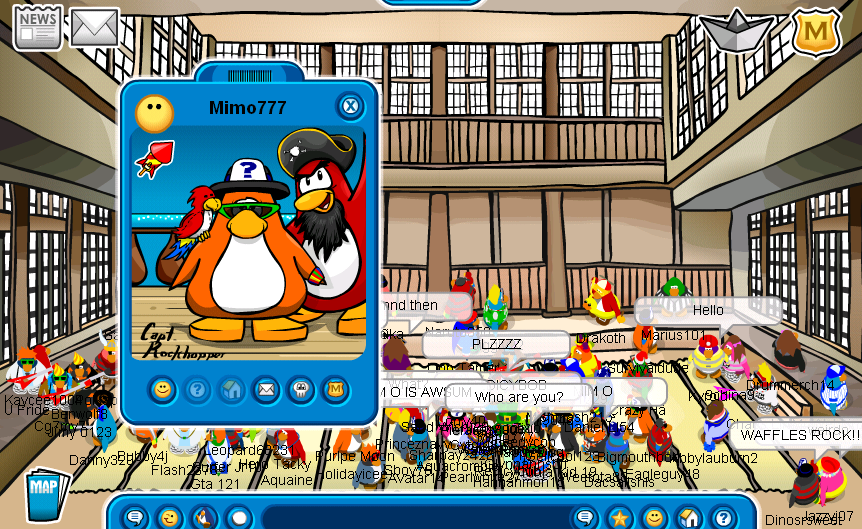
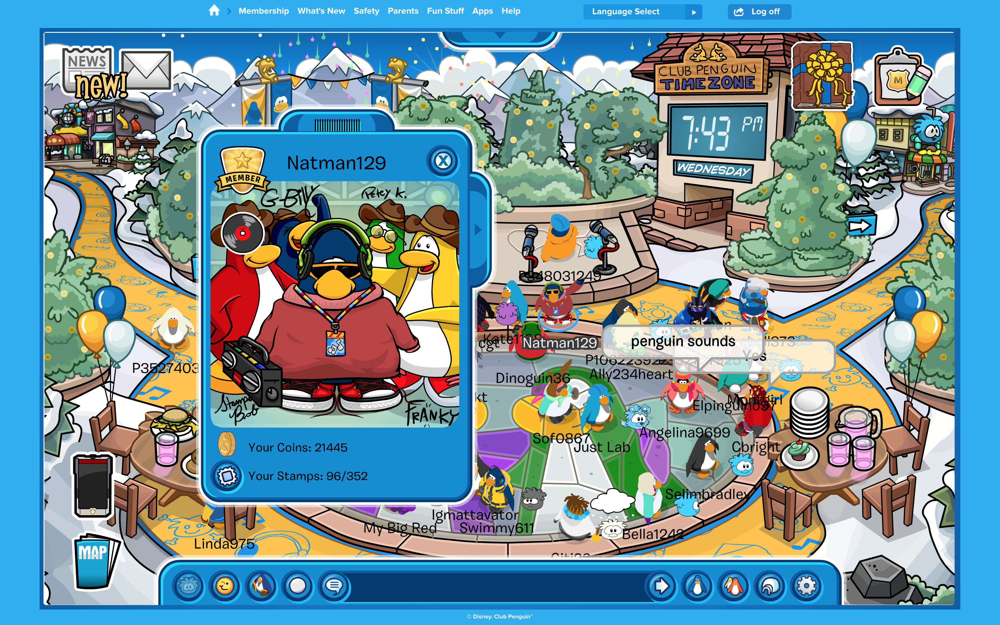
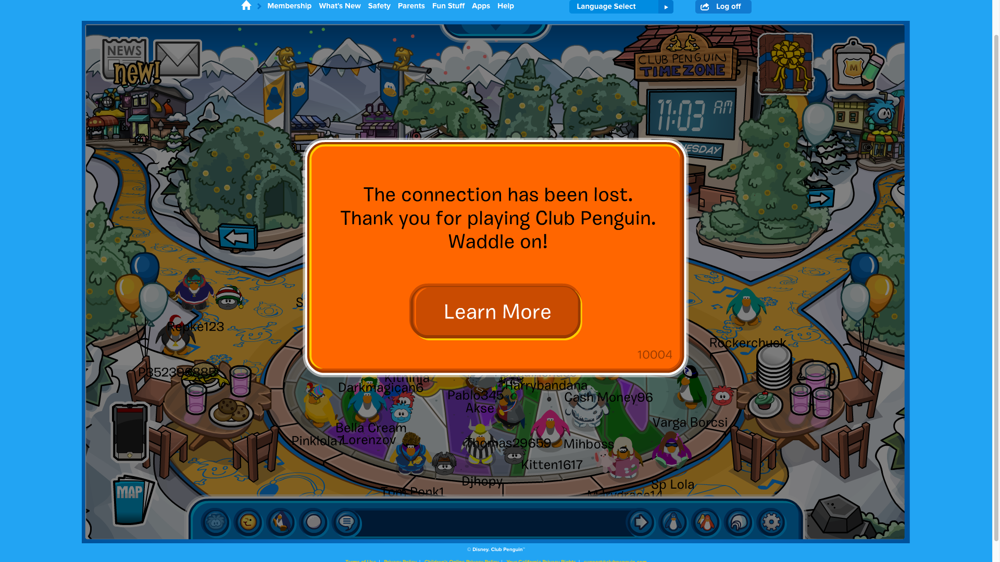
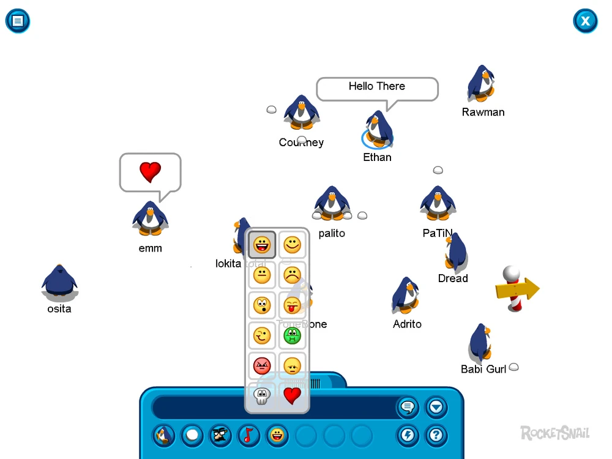

## Growing Up and Nostalgia for the Naughties

Like most people who grew up in the early naughties, online games were the forging of my childhood.

The year is 2005, and I was just discovering the joys of the family computer, it's chunky off-white monitor, trackball mouse and dial up connection lodged in the nostalgic cortex of my mind. It wasn't long until I discovered flash games, and eventually, MiniClip. This inevitably led me to discover two games that proved pivotal to both mine and many other kids childhoods, Club Penguin and RuneScape.

From here me and my twin sister religiously played both games, discovering fan sites like [Club Penguin Gang](http://www.clubpenguingang.com/) - run by the notable penguin - Mimo777 - to keep up with the various happenings in the game. 

We spent the next few years begging our parents for membership, collecting the free items occasionally drip fed to the poorer players and scouring the servers to meet famous penguins like Rockhopper, Cadance and The Penguin Band (Character portrait pictured below). Finally, our parents caved and we could don outfits bought from the Penguin Style catalog like the royalty we thought we were - non members were given no such privilege.

Nowadays nostalgia has been ruthlessly commercially weaponized, Old School RuneScape, World of Warcraft Classic and a seemingly never-ending array of remasters and remakes. With the chaotic information age firmly in our presence, people are yearning for the simpler times of youth, which brought with it comfort, simplicity and stability. Unfortunately, these can't be bought for £59.99. 

This same tinge of nostalgia is what has spurred me to attempt this project. I intend, however, to ensure I'm anchoring myself in the present, by bringing that nostalgia into the future with my own spin, rebuilding a game from 2005 in tools that Billy Bob (The original Club Penguin creator) and the team could only dreamt of having. So without further ado, let's dive into the current state of Club Penguin.

## The Club Penguin Scene in 2025

Disney took down Club Penguin in 2017, 12 years after it launched, with the intent to replace it with the now defunct Club Penguin Island, a phone app. This failed quite spectacularly, and it in turn was shut down only a year later in 2018. Why the game was originally shut down and why this attempt at a mobile port failed is a story for another time. Since then numerous private servers have emerged, in attempts to satiate the nostalgic desires of old fans. Notably Club Penguin Rewritten, which eventually got so big it faced legal troubles with Disney, and was taken down in 2022.

Since CPR's shut down, a few projects have popped up here and there, like the new Club Penguin Zero, which should launch in time for Club Penguin's 20th Anniversary in October 2025. These however all still have one major limiting factor, the fact that they use Flash. Most project utilize a flash emulator called Ruffle, to run in modern environments, however it still doesn't support 100% of ActionScript's (the scripting language Club Penguin was written in) features.

Club Penguin Journey, on the other hand, takes a completely different approach, being a fully HTML5-based rebuild that uses Phaser (An HTML5 game framework) for rendering and Yukon for server-side functionality. This allows the game to run natively in modern browsers without relying on Flash, providing a smoother, more stable experience. So yes, the goal of recreating the original Club Penguin in HTML5 has already been achieved by a team of about 10 developers, and the game is currently up for the public https://www.cpjourney.net/. 

Whilst its a great remake and runs very well, it still inherently relies on 2D systems: the clothes, items, and character models are all flat sprites, and the screen layout retains the proportions and limitations of the original game. While CPJ excels at faithfully recreating the classic experience, it remains more focused on replication rather than re-imagining the world for 2025, leaving room for a modernized rebuild that leverages full 3D models, dynamic cameras, and a truly immersive fullscreen experience.

## My Requirements

I want to keep the nostalgic charm of the original game, and ensure it really **feels** like Club Penguin, but I don't want to create another exact replica of the original, instead, I want to focus on modernizing the game. The most important part however is that it retains the original games soul.

As with all good MVPs, I'm going to be starting very small. I've decided to follow the route that the original creator Billy Bob took, with a loose remake of the Penguin Chat series. Billy Bob did create a game called Experimental Penguins before starting the Penguin Chat series, but they're all very similar in idea - A mostly white room where multiple penguins walk around and chat.

My main focus for this initial part is to lay down a very solid foundation that bridges best web practices as well as creates an environment that a game dev, designer or artist instantly feels comfortable in.

## The Plan So Far

My current MVP includes the following requirements:

- Loading the page creates a new connection, which spawns a new penguin
- The penguin can move to a location that is clicked anywhere on the page
- Whilst penguin is moving, a waddle animation happens - the penguin is idle otherwise
- The Penguin faces the direction the mouse is and can only be facing one of 8 distinct directions, NESW with diagonals.
- There is a chat bar which allows users to send messages
- Speech bubbles appear overhead of characters once a message is sent

So how the hell am I going to do this?

The plan so far, is to create 4 npm packages inside a Turborepo monorepo.

`@penguin-chat/ui` `packages/ui`
This is the HTML based UI of the game, anything that's an overlay or not a 3D model can be created isolated in this package. For example the `ChatBar` or the `CharacterModal`, this won't include things like the Penguin model.

I'll use Storybook to make developing components in isolation easy.

`@penguin-chat/web` `apps/web`
This is the renderer of the game - it'll consume the game data from the entities package, and the game ui from the ui package and combine this which any 3D models to render the game state.

I'll be using Next.js along with React Three Fiber and React Three Drei for the frontend site.

`@penguin-chat/entities` `packages/entities`
This package exposes the local game state to the renderer, it essentially models the local game world and consumes the api package to sync the local game state with the server.

I've decided to go with an entity management system package called Miniplex, which uses a system very similar to Unity.

`@penguin-chat/api` `apps/api`
Lastly the api package. For now I'll be using Fastify and Socket.IO to create a stateless web socket api - no database or ORM layer just yet. This means all connections will live in server memory, and once you log off that's it, you're penguin is no more. Sad, yes, but more than suitable for an MVP.

## The First Step

Now that we've got a plan in place (and I'm sure they'll be hiccups along the way), we can move onto the first stage, project setup.